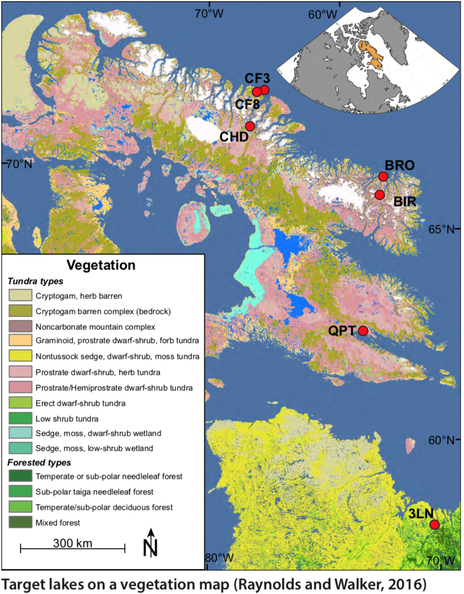
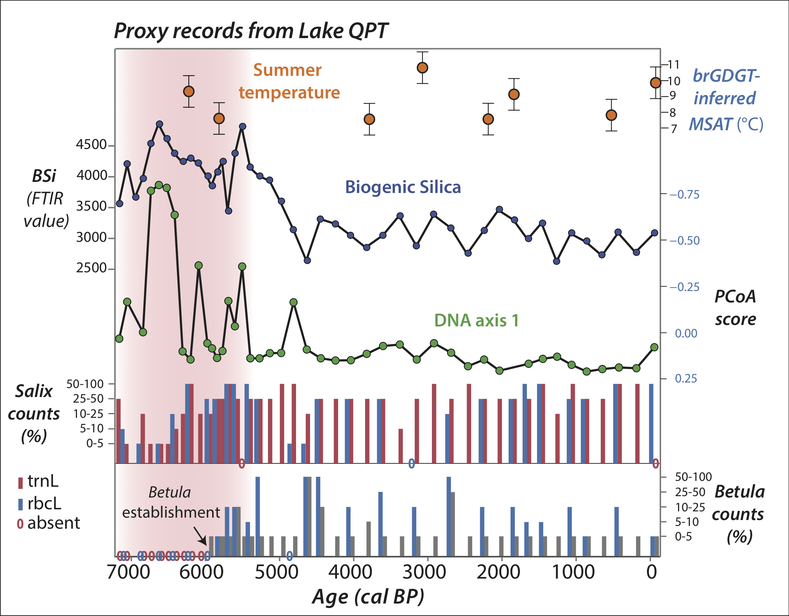
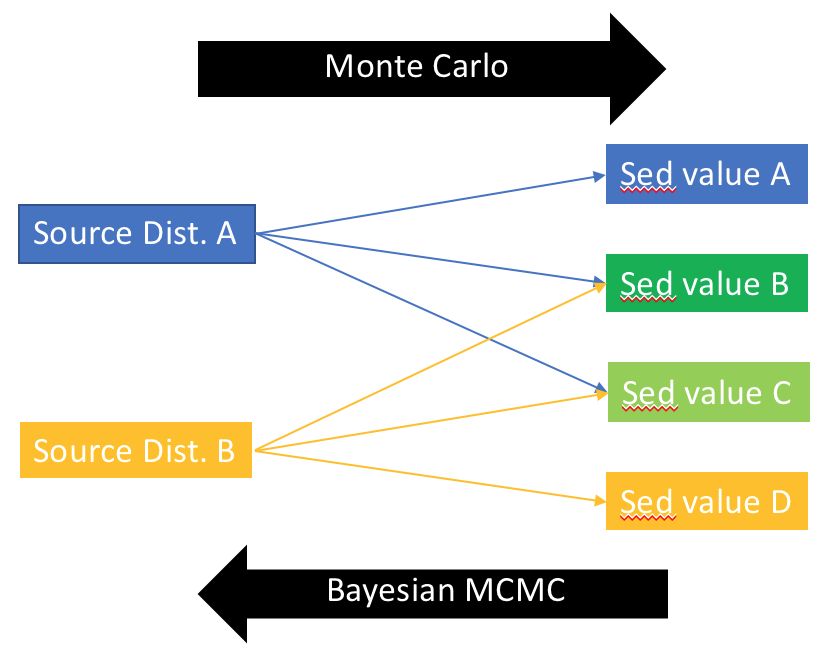
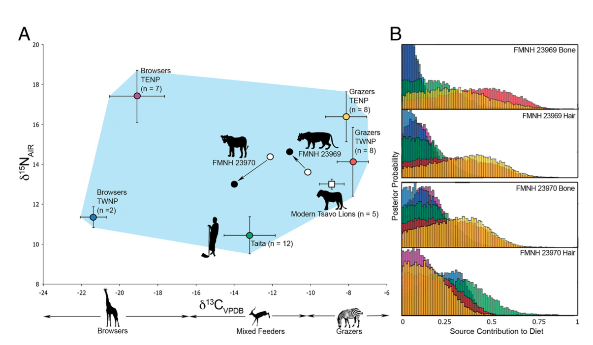

Load Libraries

```{r "load packages", include=FALSE}
library(tidyverse)
library(plotly)
library(stats)
library(ggtern)
library(latex2exp)
library(knitr)
```

# Background/Refresher

* We're interested in figuring out what the plants are going to do as the Arctic warms.
* The past is the key to the future - look at Holocene lake sediments.
* Sarah Crump's pilot study from Lake Qaupat show a shift from an aquatic to a terrestrial ecosystem ~6ka. 
* I ran Elemental Analysis on the core to see if the isotopes told the same story.
* Here, we're building a model to see if our story is plausible and/or if any new insights arise.

# Monte Carlo Simulation

We have three sources, aqautic, terrestrial, and aquatic mosses (a, t, m) and three variables we can measure, C:N, carbon isotopes, and nitrogen isotopes. We want to know, for a given amount of input of a, t, and m, what do we expect our C:N, $\delta^{13}C$, and $\delta^{15}N$ to be? Now, since there are errors associated with the proxy values for each input, we're going to do a Monte Carlo simulation that will select from a distribution within those error ranges and give us a range of outputs.


## Mass Balance

Define a simple mass balance equation that applies for all proxies. 

Mass balance equation:

$$
\begin{align*}
x =& \ \textrm{proxy} \ (\delta^{13}C, \ \delta^{15}N, \ or \ C\!:\!N) \\
a =& \ \textrm{amount of algal input} \\
t =& \ \textrm{amount of terretrial plant input} \\
m =& \ \textrm{amount of macrophyte/moss input} \\
x_{total} * (a + t + m) =& (a * x_a + t * x_t + m * x_m)
\end{align*}
$$

#### Task 1
Task 1a: define the normalization function (the evil plankton told me to do it)
Task 1b: use the normalization function in the calculate_proxy_error function

```{r Write equations}
#General normalization equation
normalize <- function() {} #Write this function!

#General mass balance equation
calculate_proxy <- function(a, proxy_a, t, proxy_t, m, proxy_m) {
  (a * proxy_a + t * proxy_t + m * proxy_m) / (a + t + m)
}

#Error for mass balance eqn
calculate_proxy_error <- function(a, proxy_a_error, t, proxy_t_error, m, proxy_m_error) {
  a_norm = ?
  t_norm = ?
  m_norm = ?
  sqrt((a_norm * proxy_a_error) ^ 2 + (t_norm * proxy_t_error) ^ 2 + (m_norm * proxy_m_error) ^ 2 )
}
```

## Define MC parameters

### Import source data 

From Florian et. al. (2015)

```{r source data import, warning=FALSE}
source_data = read.csv("data/qpt_sources_all.csv")
source_data
```
#### Question 1

Q: Which source should have the biggest (or most unique) affect on C:N? d13C? d15N?  
A:

Q: How do the magnitudes of the errors compare across the proxies and accross the sources?  
A: 

Q: What are the consequences of these uncertainties?  
A: 

### Define parameters

```{r}
#source parameters
parameters <- 
  data_frame(
    cn_a = 8.8,
    cn_t = 48,
    cn_m = 31,
    d13c_a = -30.7,
    d13c_t = -26.9,
    d13c_m = -21.8,
    d15n_a = 6.5,
    d15n_t = -1.6,
    d15n_m = 0.77
  )

parameter_errors <- 
  data_frame(
    cn_a = 0.4,
    cn_t = 29,
    cn_m = 4.6,
    d13c_a = 0.28,
    d13c_t = 1.21,
    d13c_m = 1.55,
    d15n_a = 0.42,
    d15n_t = 3.6,
    d15n_m = 0.47
  )

```

#### Task 2
Task: Pick values for a, t, and m to model

```{r}

#Table of input scenarios
input_scenarios <- 
  expand.grid(
    a = ?,
    t = ?,
    m = ?
  ) %>% 
  merge(parameters) %>% 
  tbl_df()

#calculate expected proxy values given input scenarios
simulations <- 
  input_scenarios %>% 
  merge(data_frame(i = 1:5)) %>% 
  mutate(
    a_norm = normalize(a, t, m),
    t_norm = normalize(t, a, m),
    m_norm = normalize(m, a, t),
    cn_a_w_error = cn_a + rnorm(length(a), sd = 0.25),
    cn_t_w_error = cn_t + rnorm(length(t), sd = 15),
    cn_m_w_error = cn_m + rnorm(length(m), sd = 4),
    cn = calculate_proxy(a, cn_a_w_error, t, cn_t_w_error, m, cn_m_w_error),
    d13c_a_w_error = d13c_a + rnorm(length(a), sd = 0.2),
    d13c_t_w_error = d13c_t + rnorm(length(t), sd = 0.6),
    d13c_m_w_error = d13c_m + rnorm(length(m), sd = 1.5),
    d13c = calculate_proxy(a, d13c_a_w_error, t, d13c_t_w_error, m, d13c_m_w_error),
    d15n_a_w_error = d15n_a + rnorm(length(a), sd = 0.2),
    d15n_t_w_error = d15n_t + rnorm(length(t), sd = 1.8),
    d15n_m_w_error = d15n_m + rnorm(length(m), sd = 0.5),
    d15n = calculate_proxy(a, d15n_a_w_error, t, d15n_t_w_error, m, d15n_m_w_error)
  )

simulations
```


## 2D plot of simulations

```{r, warning=FALSE}
simulations %>% 
  ggplot() +
  aes(cn, t_norm, color = a_norm) +
  geom_point()
```

#### Question 2
Q: Did we simulate the space well enough?  
A:


##3D plots of simulation

```{r 3D Plots, warning=FALSE}
q <- plot_ly(simulations, x = ~cn, y = ~d13c, z = ~d15n, color = ~a_norm) %>% 
  add_markers() %>% 
  layout(scene = list(xaxis = list(title = "C:N"),
                      yaxis = list(title = 'delta13C'),
                      zaxis = list(title = 'delta15N')))

r <- plot_ly(simulations, x = ~cn, y = ~d13c, z = ~d15n, color = ~t_norm) %>% 
  add_markers() %>% 
  layout(scene = list(xaxis = list(title = "C:N"),
                      yaxis = list(title = 'delta13C'),
                      zaxis = list(title = 'delta15N')))

s <- plot_ly(simulations, x = ~cn, y = ~d13c, z = ~d15n, color = ~m_norm) %>% 
  add_markers() %>% 
  layout(scene = list(xaxis = list(title = "C:N"),
                      yaxis = list(title = 'delta13C'),
                      zaxis = list(title = 'delta15N')))
q
r
s
```
### Question 3
Q: What are we looking at here?  
A: 

Q: Why does it taper off when it gets yellow?  
A:

# Data

Now we're going to work with some actual data that I obtained. The data come from a downcore lake sediment record of lake Qaupat (QPT) on southern Baffin Island, which we looked at on Tuesday. Here's a map:



...and here's the previous work that's been done:




## Import EA data

Now let's import the EA data (i.e. C:N, $\delta^{13}C$ and $\delta^{15}N$). I threw in the BSi data from above as well for a comparison.

```{r EA data import}
qpt_data = read.csv("data/QPT16_2A_EA_results_no_outliers.csv")
qpt_data <-
  qpt_data %>%
  mutate("d15N" = d15N - 25, #This is a relic of the data processing, should fix elsewhere
         "Bsi" = parse_number(Bsi)
    )
qpt_data
```


## Data plotted alone

```{r plot data alone}

qpt_data_plot <- 
  qpt_data %>%
  gather(var, val, c("Bsi", "d13C", "d15N", "C.N")) %>% 
  ggplot() +
  aes(Age, val, group = var) +
  geom_smooth(method = "loess", span = 0.2) +
  geom_point() +
  facet_grid(var~., scales = "free_y", switch = "y") +
  scale_x_reverse(expand = c(0,500)) + 
  scale_y_continuous(name = "") +
  xlab("Age (years)") +
  labs(title = "Lake QPT")

qpt_data_plot
```

#### Question 4
Q: Does the EA data align with the BSi? What's the same and what's different?  
A: 


## 3D plots

### Data alone

```{r 3D plot of data alone}
dataplot <- 
  plot_ly() %>% 
  add_markers(qpt_data, x = qpt_data$C.N, y = qpt_data$d13C, z = qpt_data$d15N, color = qpt_data$Age) %>% 
  layout(scene = list(xaxis = list(title = "C:N"),
                      yaxis = list(title = "delta13C"),
                      zaxis = list(title = "delta15N")
                      )) %>% 
  colorbar(title = "Age")

dataplot
```

#### Question 5
Q: Which variables explain most of the changes? Which explains the least?  
A: 

Q: Is there a clear age trend? What's your quick hypothesis as to what's causing it?  
A: 


### Data and Simulation Space Combined

Now let's pot our data onto our simulation space and see what we find.

```{r 3D plots of data and model, warning=FALSE}
q2 <- 
  plot_ly() %>% 
  add_markers(simulations, x = simulations$cn, y = simulations$d13c, z = simulations$d15n, color = simulations$a_norm, opacity = 0.3) %>% 
  add_markers(qpt_data, x = qpt_data$C.N, y = qpt_data$d13C, z = qpt_data$d15N, color = "red") %>% 
  layout(scene = list(xaxis = list(title = "C:N"),
                      yaxis = list(title = 'delta13C'),
                      zaxis = list(title = 'delta15N')))

r2 <- 
  plot_ly() %>% 
  add_markers(simulations, x = simulations$cn, y = simulations$d13c, z = simulations$d15n, color = simulations$t_norm, opacity = 0.3) %>% 
  add_markers(qpt_data, x = qpt_data$C.N, y = qpt_data$d13C, z = qpt_data$d15N, color = "red") %>%
  layout(scene = list(xaxis = list(title = "C:N"),
                      yaxis = list(title = 'delta13C'),
                      zaxis = list(title = 'delta15N')))

s2 <- 
  plot_ly() %>% 
  add_markers(simulations, x = simulations$cn, y = simulations$d13c, z = simulations$d15n, color = simulations$m_norm, opacity = 0.3) %>% 
  add_markers(qpt_data, x = qpt_data$C.N, y = qpt_data$d13C, z = qpt_data$d15N, color = "red") %>% 
  layout(scene = list(xaxis = list(title = "C:N"),
                      yaxis = list(title = 'delta13C'),
                      zaxis = list(title = 'delta15N')))

q2
r2
s2
```

#### Question 6
Q: Do the data fall within the simulation space?  
A: 

Q: If no, why might that be the case?  
A: 


# Optimization

So now we're going to try to quantify what we just observed visually. 

We're going to perform an optimization test that is going to take a real data point (C:N, d13c, d15n) and find the optimal values of a, t, m (weighted by the errors in the proxies).

How do we know how well our model is doing? We'll use the formula for distance on a Cartesian space to see how far the optimal points are from the real data. If the distance is zero, the model is right on top of our data point and we have a perfect fit!

$$
distance = \sqrt{(x_{model} - x_{real})^2 + (y_{model} - y_{real})^2 +(z_{model} - z_{real})^2}
$$

But being really far off in $\delta^{13}C$ isn't so bad because there's a lot of variation. In other words, being 2 permille off for carbon is not nearly as bad as being 2 permille off for nitrogen.

To deal with this, we'll also normalize these distances by their standard deviations. It's a little hand-wavy, but should give us a better answer than no error consideration at all.

$$
\begin{align*}
x =& \ \delta^{13}C \\
y =& \ \delta^{15}C \\
z =& \ C:N \\
distance =& \sqrt{(x_{model} - x_{real})^2 / (SD_x)^2 + (y_{model} - y_{real})^2  / (SD_y)^2 +(z_{model} - z_{real})^2  / (SD_z)^2}
\end{align*}
$$


## Optim function

Here we'll define our optimization function. It takes a give combination of sources (c(a, t, m)) and a real piece of data (with index = i) and spits out the distance between the value predicted by the sources and the real value.

```{r Best fits}

optim_function <- function(x, i) {
  a <- x[1]
  t <- x[2]
  m <- x[3]
  
  #calculate proxies
  dcn <- calculate_proxy(a, parameters$cn_a, t, parameters$cn_t, m, parameters$cn_m)
  d13c <- calculate_proxy(a, parameters$d13c_a, t, parameters$d13c_t, m, parameters$d13c_m)
  d15n <- calculate_proxy(a, parameters$d15n_a, t, parameters$d15n_t, m, parameters$d15n_m)
  
  #calculate errors
  dcn_error <- calculate_proxy_error(a, parameter_errors$cn_a, t, parameter_errors$cn_t, m, parameter_errors$cn_m)
  d13c_error <- calculate_proxy_error(a, parameter_errors$d13c_a, t, parameter_errors$d13c_t, m, parameter_errors$d13c_m)
  d15n_error <- calculate_proxy_error(a, parameter_errors$d15n_a, t, parameter_errors$d15n_t, m, parameter_errors$d15n_m)
  
  #calculate distance btwn test point and data
  sqrt(((dcn - qpt_data$C.N[i]) / dcn_error)^2 + ((d13c - qpt_data$d13C[i]) / d13c_error)^2 + ((d15n - qpt_data$d15N[i]) / d15n_error)^2)
}
```

Let's examine what this puts out:
```{r}
best_fit_i = 3
best_fit <- optim(c(0.33, 0.33, 0.34), i = best_fit_i, optim_function, method = "L-BFGS-B", lower = 0, upper = 1)
best_fit
```


## Fit data

Now we're going to take our full data set and find the optimal values of a, t, and m. 

```{r}
qpt_data <- qpt_data %>% mutate(i = row_number())

optim_results <- 
  qpt_data %>% select(i) %>% 
  group_by(i) %>%
  do({
    i <- .$i[1]
    result <- optim(c(0.33, 0.33, 0.34), i = i, optim_function, method = "L-BFGS-B", lower = 0, upper = 1)
    # normalize output
    data_frame(
      a_optim = result$par[1] / sum(result$par), 
      t_optim = result$par[2] / sum(result$par), 
      m_optim = result$par[3] / sum(result$par), 
      distance_optim = result$value,
      convergence = result$convergence # If != 0, didn't converge
    )
  })

qpt_data_optim <- 
  left_join(qpt_data, optim_results, by = "i") %>% 
  mutate(tot_optim = a_optim + t_optim + m_optim)
qpt_data_optim
```


## Plot data (ternary)

Here, we'll create a ternary diagram with a, t, m (norm) as the axes and all our data points plotted. We'll color them by age and size them by their best fit distances.

```{r}
qpt_data_optim_plot <- qpt_data_optim %>% 
  ggtern(aes(a_optim, t_optim, m_optim, color = Age, size = distance_optim)) +
  theme_nomask() + 
  geom_point() + 
  scale_color_gradient2(low = "dark blue", mid = "dark green", high = "gold", midpoint = 3500) +
  scale_size_continuous(range = c(10,1))

qpt_data_optim_plot

```

#### Question 7
Q: Was our model able to fit the points well? Any points that look suspect?  
A: 

Q: Do the suspect points make sense? Think back to the 3D plots from earlier.  
A: 


## Assess fits

Now we have some results, but we already suspect that some of the fits we got from our model might not be so great. Let's analyze how good these fits are.


#### Task 3
Task: Let's see how this works for data points i = 3, 15, and 20 (and 5 if there's time)

```{r}
best_fit_i = 3
best_fit <- optim(c(0.33, 0.33, 0.34), i = best_fit_i, optim_function, method = "L-BFGS-B", lower = 0, upper = 1)
#best_fit

best_fit_a = best_fit$par[1] / sum(best_fit$par)
best_fit_t = best_fit$par[2] / sum(best_fit$par)
best_fit_m = best_fit$par[3] / sum(best_fit$par)
```


This is useful, but it's still just spitting out a number. It doesn't really give us a sense of how variable the fit is. So let's do some plotting.

### Tile plot

Now let's make a ternary plot for (a, t, m), calculate how well each (a, t, m) fits sample i, and display the result as a tile weighted by the goodness of fit (0 = perfect). We'll also plot our result from "best_fit", which should show up at the optimal point.

This will allow us to see the gradient of our optim function, i.e. how much wiggle room we have with our fit. It might even allow us to see some second-best fits, i.e. local minima.

#### Task 4

Change the resolution of our plot by playing with the number of bins.

```{r, warning=FALSE}
expand.grid(
  a = seq(0,1, by=0.05),
  t = seq(0,1, by=0.05),
  m = seq(0,1, by=0.05)
) %>% 
  tbl_df() %>% 
  mutate(
    allsum = a+t+m,
    a = a/allsum,
    t = t/allsum,
    m = m/allsum,
    value = map2_dbl(a, t, ~optim_function(c(.x, .y, best_fit_m), best_fit_i))) %>% 
  filter(!is.na(value), !is.nan(value)) %>% 
  ggtern(aes(a,t,m)) +
  # calculate mean estimate in each bin
  geom_tri_tern(bins = 5, mapping = aes(fill=..stat..,value=value), fun = mean) +
  # mark minimum
  geom_point(data = qpt_data_optim, aes(
    x = qpt_data_optim$a_optim[best_fit_i], 
    y = qpt_data_optim$t_optim[best_fit_i], 
    z = qpt_data_optim$m_optim[best_fit_i]), color = "red") 
  # + scale_fill_gradientn(colours = rainbow(7)) 
```


#### Question 8
Q: What did you learn about the goodness of our fits?  
A: 

Q: Did it look like all of the points had a global minimum on our simulation space?  
A: 

Q: What conclusions can you draw? How well did this model work?  
A: 


# MixSIAR

Outside of this file, I also played a lot with a mixing model called MixSIAR. We'll discuss it briefly.

MixSIAR is a Bayesian Markov Chain Monte Carlo stable isotope mixing model. Like the simulation we just did, it's going to take us from our data to our a, t, m space, but in a more mathematically refined way.



## Isospace

First, we'll make a plot analogous to the one in the man-eating lions paper (Yeakel et. al., 2009):



```{r, warning=FALSE}
isospace <- 
  ggplot() + 
  geom_point(data = qpt_data, aes(x = d13C, y = d15N, color = Age)) + 
  #geom_path(data = qpt_data, aes(x = d13C, y = d15N, color = Age), size = 0.2) +
  scale_color_gradient2(low = "dark blue", mid = "dark green", high = "gold", midpoint = 3500) +
  geom_point(data = source_data, aes(x = Meand13C, y = Meand15N), color = "black") + 
  geom_errorbar(data = source_data, aes(
    x = Meand13C, y = Meand15N, ymin = Meand15N - SDd15N, ymax = Meand15N + SDd15N)) +
  geom_errorbarh(data = source_data, aes(
    x = Meand13C, y = Meand15N, xmin = Meand13C - SDd13C, xmax = Meand13C + SDd13C)) +
  geom_text(data = source_data, aes(x = Meand13C, y = Meand15N, label = Source, hjust = -0.5, vjust = 2)) +
  labs(
    title = "Lake QPT Isospace", 
    color = "Age (yrs)", 
    x = latex2exp::TeX("$\\delta^{13}C$"), 
    y = latex2exp::TeX("$\\delta^{15}N$"))
isospace
```

#### Question 9
Q: Spoiler alert: the model didn't really work out. Why might that be?  
A:

Previously, it looked like C:N changed more than $\delta^{15}N$. Let's see if that still looks true on an isoscape:

```{r d13C and CN isospace, warning=FALSE}
#source_data_cn <- read.csv("data/qpt_sources_cn.csv")

isospace_cn <- 
  ggplot() + 
  geom_point(data = qpt_data, aes(x = d13C, y = C.N, color = Age)) + 
  #geom_path(data = qpt_data, aes(x = d13C, y = d15N, color = Age), size = 0.2) +
  scale_color_gradient2(low = "dark blue", mid = "dark green", high = "gold", midpoint = 3500) +
  geom_point(data = source_data, aes(x = Meand13C, y = MeanCN), color = "black") + 
  geom_errorbar(data = source_data, aes(
    x = Meand13C, y = MeanCN, ymin = MeanCN - SDCN, ymax = MeanCN + SDCN)) +
  geom_errorbarh(data = source_data, aes(
    x = Meand13C, y = MeanCN, xmin = Meand13C - SDd13C, xmax = Meand13C + SDd13C)) +
  geom_text(data = source_data, aes(x = Meand13C, y = MeanCN, label = Source, hjust = -0.5, vjust = 2)) +
  labs(
    title = "Lake QPT Isospace", 
    color = "Age (yrs)", 
    x = latex2exp::TeX("$\\delta^{13}C$"), 
    y = latex2exp::TeX("$\\C:N$"))

isospace_cn
```

#### Question 10
Q: Does this look better? Think we'd get a good model output from this?  
A:

# Conclusions
* Know your model! And know how to assess how well it's doing. People often say a stupid model will give you a stupid result, but a meh model that gives meh results isn't really useful either. Strive to make smart models that give smart results!
* Mixing models don't always work. You really need to have *all* of your sources, and they need to be well defined with as little standard deviation as possible.
* Mixing models have an extra problem in paleo work - if the proxy you're measuring might be affected by decomposition/diagenesis, you'd need to correct for that, which is likely hard to do.
* Assuming that the proxy *trends* are real, even if the magnitudes change, a well-informed qualitative interpretation may sometimes be the best tool in a paleoecologist's toolbox.

