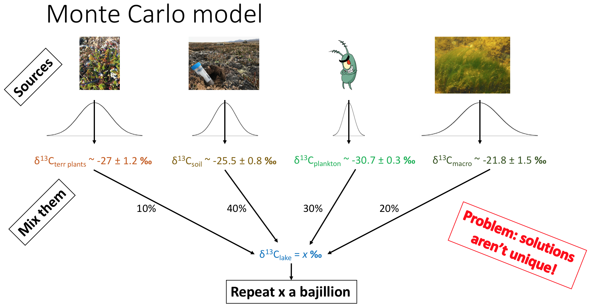

#Load Libraries

```{r "load packages", include=FALSE}
library(tidyverse)
library(plotly)
library(stats)
library(FactoMineR)
library(ggtern)
library(latex2exp)
```

#Background


# Monte Carlo Simulation

We have three sources, aqautic, terrestrial, and aquatic mosses (a, t, m) and three variables we can measure, C:N, carbon isotopes, and nitrogen isotopes. We want to know, for a given amount of input of a, t, and m, what do we expect our C:N, $\delta^{13}C$, and $\delta^{15}N$ to be? Now, since there are errors associated with the proxy values for each input, we're going to do a Monte Carlo simulation that will select from a distribution within those error ranges and give us a range of outputs.




##Define parameters

Define a simple mass balance equation that applies for all proxies. 

Mass balance equation:

$$
\begin{align*}
x =& \ \textrm{proxy} \ (\delta^{13}C, \ \delta^{15}N, \ or \ C\!:\!N) \\
a =& \ \textrm{amount of algae input} \\
t =& \ \textrm{amount of terretrial plant input} \\
m =& \ \textrm{amount of macrophyte/moss input} \\
x_{total} * (a + t + m) =& (a * x_a + t * x_t + m * x_m)
\end{align*}
$$

Task: define the normalization function (the evil plankton told me to do it)

```{r Simulate}
#General normalization equation
normalize <- function(x, y, z) {
  x / (x + y + z)
}

#General mass balance equation
calculate_proxy <- function(a, proxy_a, t, proxy_t, m, proxy_m) {
  (a * proxy_a + t * proxy_t + m * proxy_m) / (a + t + m)
}

#Error for mass balance eqn
calculate_proxy_error <- function(a, proxy_a_error, t, proxy_t_error, m, proxy_m_error) {
  a_norm = normalize(a, t, m)
  t_norm = normalize(t, a, m)
  m_norm = normalize(m, a, t)
  sqrt((a_norm * proxy_a_error) ^ 2 + (t_norm * proxy_t_error) ^ 2 + (m_norm * proxy_m_error) ^ 2 )
}

# basic parameters
parameters <- 
  data_frame(
    cn_a = 8.75,
    cn_t = 48,
    cn_m = 31,
    d13c_a = -30.7,
    d13c_t = -26.9,
    d13c_m = -22,
    d15n_a = 6.5,
    d15n_t = -1.6,
    d15n_m = 0.8
  )

parameter_errors <- 
  data_frame(
    cn_a = 0.25,
    cn_t = 15,
    cn_m = 4,
    d13c_a = 0.2,
    d13c_t = 0.6,
    d13c_m = 1.5,
    d15n_a = 0.2,
    d15n_t = 1.8,
    d15n_m = 0.5
  )

# Testing these functions:
# calculate_proxy(0.3, parameters$cn_a, 0.3, parameters$cn_t, 0.4, parameters$cn_m)
# calculate_proxy_error(0.3, parameter_errors$cn_a, 0.3, parameter_errors$cn_t, 0.4, parameter_errors$cn_m)


#Table of inputs
input_scenarios <- 
  expand.grid(
    a = seq(0, 100, 10),
    t = seq(0, 100, 10),
    m = seq(0, 100, 10)
  ) %>% 
  merge(parameters) %>% 
  tbl_df()


simulations <- 
  input_scenarios %>% 
  merge(data_frame(i = 1:5)) %>% 
  mutate(
    a_norm = normalize(a, t, m),
    t_norm = normalize(t, a, m),
    m_norm = normalize(m, a, t),
    cn_a_w_error = cn_a + rnorm(length(a), sd = 0.25),
    cn_t_w_error = cn_t + rnorm(length(t), sd = 15),
    cn_m_w_error = cn_m + rnorm(length(m), sd = 4),
    cn = calculate_proxy(a, cn_a_w_error, t, cn_t_w_error, m, cn_m_w_error),
    d13c_a_w_error = d13c_a + rnorm(length(a), sd = 0.2),
    d13c_t_w_error = d13c_t + rnorm(length(t), sd = 0.6),
    d13c_m_w_error = d13c_m + rnorm(length(m), sd = 1.5),
    d13c = calculate_proxy(a, d13c_a_w_error, t, d13c_t_w_error, m, d13c_m_w_error),
    d15n_a_w_error = d15n_a + rnorm(length(a), sd = 0.2),
    d15n_t_w_error = d15n_t + rnorm(length(t), sd = 1.8),
    d15n_m_w_error = d15n_m + rnorm(length(m), sd = 0.5),
    d15n = calculate_proxy(a, d15n_a_w_error, t, d15n_t_w_error, m, d15n_m_w_error)
  )

simulations
```

####Q1 

Q: Which source should have the biggest (or most unique) affect on C:N? d13C? d15N?
A: Algal for C:N and d15N since it's so different. d13C is tougher to say.

Q: How do the magnitudes of the errors compare across the proxies and accross the sources?
A: Biggest for C:N, esp terrestrial.

Q: What are the consequences of these uncertainties?
A: They will introduce uncertainties in our ratios of a, t, and m.


```{r, warning=FALSE}
simulations %>% 
  ggplot() +
  aes(cn, t_norm, color = a_norm) +
  geom_point()
```
####Q2
Q: Did we simulate the space well enough?
A: Probably. Definitely gaps that we could fill in, but get the overall picture.


##3D plots of sim

```{r 3D Plots}
q <- plot_ly(simulations, x = ~cn, y = ~d13c, z = ~d15n, color = ~a_norm) %>% 
  add_markers() %>% 
  layout(scene = list(xaxis = list(title = "C:N"),
                      yaxis = list(title = 'delta13C'),
                      zaxis = list(title = 'delta15N')))

r <- plot_ly(simulations, x = ~cn, y = ~d13c, z = ~d15n, color = ~t_norm) %>% 
  add_markers() %>% 
  layout(scene = list(xaxis = list(title = "C:N"),
                      yaxis = list(title = 'delta13C'),
                      zaxis = list(title = 'delta15N')))

s <- plot_ly(simulations, x = ~cn, y = ~d13c, z = ~d15n, color = ~m_norm) %>% 
  add_markers() %>% 
  layout(scene = list(xaxis = list(title = "C:N"),
                      yaxis = list(title = 'delta13C'),
                      zaxis = list(title = 'delta15N')))
q
r
s
```
###Q3
Q: What are we looking at here?
A: The space of simulated possibilities.


#Data

Import my EA data
```{r data import}
qpt_data = read.csv("QPT16_2A_EA_results_no_outliers.csv")
qpt_data <-
  qpt_data %>%
  mutate("d15N" = d15N - 25, #This is a relic of the data processing, should fix elsewhere
         "Bsi" = parse_number(Bsi)
    )
qpt_data
```


Import source data from Florian 2015
```{r source data import}
source_data = read.csv("qpt_sources.csv")
source_data
```


##Data plotted alone

```{r plot data alone}

qpt_data_plot <- 
  qpt_data %>%
  gather(var, val, c("Bsi", "d13C", "d15N", "C.N")) %>% 
  ggplot() +
  aes(Age, val, group = var) +
  #geom_smooth(method = "lm", color = "red") +
  geom_smooth(method = "loess", span = 0.2) +
  geom_point() +
  facet_grid(var~., scales = "free_y", switch = "y") +
  scale_x_reverse(expand = c(0,500)) + 
  scale_y_continuous(name = "") +
  xlab("Age (years)") +
  labs(title = "Lake QPT")

qpt_data_plot
```

####Q4
Q: Does the EA data align with the BSi? What's the same and what's different?
A: Kind of... The overall pattern of things happening until ~5ka, followed by a stable period until ~ 1ka, and finally some changes up until the present seems to hold, but the trends are not as simple as they are for BSi.


##3D plots

```{r 3D plot of data alone}
dataplot <- 
  plot_ly() %>% 
  add_markers(qpt_data, x = qpt_data$C.N, y = qpt_data$d13C, z = qpt_data$d15N, color = qpt_data$Age) %>% 
  layout(scene = list(xaxis = list(title = "C:N"),
                      yaxis = list(title = "delta13C"),
                      zaxis = list(title = "delta15N")
                      )) %>% 
  colorbar(title = "Age")

dataplot
```

####Q5
Q: Which variables explain most of the changes? Which explains the least?
A: Variation is controlled by d13C and C:N and not really by d15N.

Q: Is there a clear age trend? What's your quick hypothesis as to what's causing it?
A: Yes! Decreasing d13C and increasing C:N. Both suggest increasing terrestrial input.


## Isospace

```{r, warning=FALSE}
isospace <- 
  ggplot() + 
  geom_point(data = qpt_data, aes(x = d13C, y = d15N, color = Age)) + 
  #geom_path(data = qpt_data, aes(x = d13C, y = d15N, color = Age), size = 0.2) +
  scale_color_gradient2(low = "dark blue", mid = "dark green", high = "gold", midpoint = 3500) +
  geom_point(data = source_data, aes(x = Meand13C, y = Meand15N), color = "black") + 
  geom_errorbar(data = source_data, aes(
    x = Meand13C, y = Meand15N, ymin = Meand15N - SDd15N, ymax = Meand15N + SDd15N)) +
  geom_errorbarh(data = source_data, aes(
    x = Meand13C, y = Meand15N, xmin = Meand13C - SDd13C, xmax = Meand13C + SDd13C)) +
  geom_text(data = source_data, aes(x = Meand13C, y = Meand15N, label = X, hjust = -0.5, vjust = 2)) +
  labs(
    title = "Lake QPT Isospace", 
    color = "Age (yrs)", 
    x = latex2exp::TeX("$\\delta^{13}C$"), 
    y = latex2exp::TeX("$\\delta^{15}N$"))
isospace
```


```{r 3D plots of data and model}
q2 <- 
  plot_ly() %>% 
  add_markers(simulations, x = simulations$cn, y = simulations$d13c, z = simulations$d15n, color = simulations$a_norm, opacity = 0.3) %>% 
  add_markers(qpt_data, x = qpt_data$C.N, y = qpt_data$d13C, z = qpt_data$d15N, color = "red") %>% 
  layout(scene = list(xaxis = list(title = "C:N"),
                      yaxis = list(title = 'delta13C'),
                      zaxis = list(title = 'delta15N')))

r2 <- 
  plot_ly() %>% 
  add_markers(simulations, x = simulations$cn, y = simulations$d13c, z = simulations$d15n, color = simulations$t_norm, opacity = 0.3) %>% 
  add_markers(qpt_data, x = qpt_data$C.N, y = qpt_data$d13C, z = qpt_data$d15N, color = "red") %>%
  layout(scene = list(xaxis = list(title = "C:N"),
                      yaxis = list(title = 'delta13C'),
                      zaxis = list(title = 'delta15N')))

s2 <- 
  plot_ly() %>% 
  add_markers(simulations, x = simulations$cn, y = simulations$d13c, z = simulations$d15n, color = simulations$m_norm, opacity = 0.3) %>% 
  #add_markers(qpt_data, x = qpt_data$C.N, y = qpt_data$d13C, z = qpt_data$d15N, color = "red", fill = "blue") %>% 
  layout(scene = list(xaxis = list(title = "C:N"),
                      yaxis = list(title = 'delta13C'),
                      zaxis = list(title = 'delta15N')))

q2
r2
s2
```

# Optimization

This optimization test is going to take a real data point (C:N, d13c, d15n) and find the optimal values of a, t, m (weighted by the errors in the proxies).

##Optim function
```{r Best fits}

optim_function <- function(x, i) {
  a <- x[1]
  t <- x[2]
  m <- x[3]
  #calculate proxies
  dcn <- calculate_proxy(a, parameters$cn_a, t, parameters$cn_t, m, parameters$cn_m)
  d13c <- calculate_proxy(a, parameters$d13c_a, t, parameters$d13c_t, m, parameters$d13c_m)
  d15n <- calculate_proxy(a, parameters$d15n_a, t, parameters$d15n_t, m, parameters$d15n_m)
  #calculate errors
  dcn_error <- calculate_proxy_error(a, parameter_errors$cn_a, t, parameter_errors$cn_t, m, parameter_errors$cn_m)
  d13c_error <- calculate_proxy_error(a, parameter_errors$d13c_a, t, parameter_errors$d13c_t, m, parameter_errors$d13c_m)
  d15n_error <- calculate_proxy_error(a, parameter_errors$d15n_a, t, parameter_errors$d15n_t, m, parameter_errors$d15n_m)
  #calculate distance btwn test point and data
  sqrt(((dcn - qpt_data$C.N[i]) / dcn_error)^2 + ((d13c - qpt_data$d13C[i]) / d13c_error)^2 + ((d15n - qpt_data$d15N[i]) / d15n_error)^2)
  #x[1] + x[2] + x[3] == 1
}

#iterate over test points, starting at (0.3, 0.3, 0.4), and return lowest distance
best_fit <- optim(c(0.3, 0.3, 0.4), i = 3, optim_function, method = "L-BFGS-B", lower = 0, upper = 1, hessian = TRUE)
best_fit2 <- optim(c(0.3, 0.3, 0.4), i = 3, optim_function, method = "Nelder-Mead", hessian = TRUE)


# best_fit <- optim(c(0.3, 0.3), i = 2, optim_function, method = "BFGS")
# best_fit

```

##Optim performance test

Now lets make a plot of a vs. t, calculate how well each (a,t) fits data point i, and display the result as a tile weighted by the goodness of fit (0 = perfect). We'll also plot our result from "best_fit", which should show up at the optimal point.

This might allow us to see some second-best fits, i.e. local minima.
```{r Optimization space tiles}
tiles <- expand.grid(
  a = seq(0, 1, by = 0.1),
  t = seq(0, 1, by = 0.1)
) %>% 
  mutate(
    optim_result = map2_dbl(a, t, ~optim_function(c(.x, .y))) 
    #takes normalized a and t and plugs them into optim_function as a vector, return a <dbl> (number)
  ) 


tiles %>% 
  ggplot() +
  aes(a, t) +
  geom_tile(mapping = aes(fill = log(optim_result))) +
  geom_point(data = data_frame(a = best_fit$par[1], t = best_fit$par[2]), color = "red")
```


#Fit data

Now we're going to take our real data and find the optimal values of a, t, and m. 

```{r}
qpt_data <- qpt_data %>% mutate(i = row_number())

optim_results <- 
  qpt_data %>% select(i) %>% 
  group_by(i) %>%
  do({
    i <- .$i[1]
    result <- optim(c(0.33, 0.33, 0.34), i = i, optim_function, method = "L-BFGS-B", lower = 0, upper = 1)
    data_frame(
      a_optim = result$par[1] / sum(result$par), 
      t_optim = result$par[2] / sum(result$par), 
      m_optim = result$par[3] / sum(result$par), 
      distance_optim = result$value
    )
  })

qpt_data_optim <- 
  left_join(qpt_data, optim_results, by = "i") %>% 
  mutate(tot_optim = a_optim + t_optim + m_optim)
qpt_data_optim
```

##Ternary diagrams

A. A ternary diagram just like seb's example, i.e. tiles colored by the goodness of fit for one data point with that data point displayed. a, t, m (norm) as the axes. For this we need a data table containing:
qpt_data, mutate a column of the optimize function results
B. A ternary diagram with a, t, m (norm) as the axes, all data points plotted and colored by their "best_fit" value.
C. Same axes, all data points plotted, colored by their age, optionally inversely sized by the best_fit value

```{r}
qpt_data_optim_plot <- qpt_data_optim %>% 
  ggtern(aes(a_optim, t_optim, m_optim, color = Age, size = distance_optim, text = paste("Age:", Age))) +
  theme_nomask() + 
  geom_point() + 
  scale_color_gradientn(colors = rainbow(3)) +
  scale_size_continuous(range = c(10,1))

qpt_data_optim_plot #<- ggplotly(qpt_data_optim_plot)

```


#MixSIAR

## Import results

```{r}
# p_fac1_1 <- 
#   read_csv("p_fac1.csv") %>% 
#   rename(Mosses = V1, Plankton = V2, Soil = V3, Terrestrial = V4)
# p_fac1_2 <- 
#   read_csv("p_fac1_2.csv") %>% 
#   rename(Mosses = V1, Plankton = V2, Soil = V3, Terrestrial = V4)
# p_fac1_3 <- 
#   read_csv("p_fac1_3.csv") %>% 
#   rename(Mosses = V1, Plankton = V2, Soil = V3, Terrestrial = V4)

p_fac1_1_nosoil <- 
  read_csv("p_fac1_1_nosoil.csv") %>% 
  rename(Mosses = V1, Plankton = V2, Terrestrial = V3)
p_fac1_2_nosoil <- 
  read_csv("p_fac1_2_nosoil.csv") %>% 
  rename(Mosses = V1, Plankton = V2, Terrestrial = V3)
p_fac1_3_nosoil <- 
  read_csv("p_fac1_3_nosoil.csv") %>% 
  rename(Mosses = V1, Plankton = V2, Terrestrial = V3)

```


## Plot results

```{r}
plot_p_fac1_1 <- 
  p_fac1_1 %>%
  gather(key = "Source", value = "Input", Mosses, Soil, Plankton, Terrestrial) %>% 
  ggplot() +
  aes(Age, Input, fill = Source) +
  geom_area() +
  scale_y_continuous(labels = scales::percent, expand = c(0,0)) +
  scale_x_continuous(expand = c(0,0)) +
  labs(title = "Results: First MCMC chain")

plot_p_fac1_2 <- 
  p_fac1_2 %>%
  gather(key = "Source", value = "Input", Mosses, Soil, Plankton, Terrestrial) %>% 
  ggplot() +
  aes(Age, Input, fill = Source) +
  geom_area() +
  scale_y_continuous(labels = scales::percent, expand = c(0,0)) +
  scale_x_continuous(expand = c(0,0)) +
  labs(title = "Results: Second MCMC chain")

plot_p_fac1_3 <- 
  p_fac1_3 %>%
  gather(key = "Source", value = "Input", Mosses, Soil, Plankton, Terrestrial) %>% 
  ggplot() +
  aes(Age, Input, fill = Source) +
  geom_area() +
  scale_y_continuous(labels = scales::percent, expand = c(0,0)) +
  scale_x_continuous(expand = c(0,0)) +
  labs(title = "Results: Third MCMC chain")

plot_p_fac1_all <- grid.arrange(plot_p_fac1_1, plot_p_fac1_2, plot_p_fac1_3, ncol = 1)

# v1 = moss, v2 = plankton, v3 = soil, v4 = terrestrial
```

```{r}
plot_p_fac1_1_nosoil <- 
  p_fac1_1_nosoil %>%
  gather(key = "Source", value = "Input", Mosses, Plankton, Terrestrial) %>% 
  ggplot() +
  aes(Age, Input, fill = Source) +
  geom_area() +
  scale_y_continuous(labels = scales::percent, expand = c(0,0)) +
  scale_x_continuous(expand = c(0,0)) +
  labs(title = "Results: First MCMC chain (no soil)")

plot_p_fac1_2_nosoil <- 
  p_fac1_2_nosoil %>%
  gather(key = "Source", value = "Input", Mosses, Plankton, Terrestrial) %>% 
  ggplot() +
  aes(Age, Input, fill = Source) +
  geom_area() +
  scale_y_continuous(labels = scales::percent, expand = c(0,0)) +
  scale_x_continuous(expand = c(0,0)) +
  labs(title = "Results: Second MCMC chain (no soil)")

plot_p_fac1_3_nosoil <- 
  p_fac1_3_nosoil %>%
  gather(key = "Source", value = "Input", Mosses, Plankton, Terrestrial) %>% 
  ggplot() +
  aes(Age, Input, fill = Source) +
  geom_area() +
  scale_y_continuous(labels = scales::percent, expand = c(0,0)) +
  scale_x_continuous(expand = c(0,0)) +
  labs(title = "Results: Third MCMC chain (no soil)")

plot_p_fac1_all <- grid.arrange(plot_p_fac1_1_nosoil, plot_p_fac1_2_nosoil, plot_p_fac1_3_nosoil, ncol = 1)

# v1 = moss, v2 = plankton, v3 = soil, v4 = terrestrial
```


#Examples/supplemental

```{r}
qpt_data_optim %>% 
  mutate(
    error = 0.05,
    a_min = ifelse(a_optim < error, 0, a_optim - error),
    t_min = ifelse(t_optim < error, 0, t_optim - error),
    m_min = ifelse(m_optim < error, 0, m_optim - error),
    a_mean = a_optim - a_min,
    t_mean = t_optim - t_min,
    m_mean = m_optim - m_min
  ) %>% 
  gather(var, value, a_min, a_mean, t_min, t_mean, m_min, m_mean) %>% 
  ggplot() +
  aes(Age, value, fill = var) +
  geom_area()+
  scale_y_continuous(labels = scales::percent, expand = c(0,0)) +
  scale_x_continuous(expand = c(0,0)) + 
  scale_fill_brewer(palette = "Paired")
  #geom_bar(stat = "identity") 
```


#### d15N space

```{r, warning=FALSE}
tern_dataset <- simulations %>% 
  select(a_norm, t_norm, m_norm, d13c, d15n, cn) %>% 
  filter(!is.na(d13c),!is.nan(d13c)) %>% 
  group_by(a_norm, t_norm, m_norm) %>% 
  summarize_at(vars(d13c, d15n, cn), funs(mean,sd)) 

plot_d13c <- tern_dataset %>% 
  ggtern(aes(a_norm,t_norm,m_norm)) +
  aes(value = d13c_mean) +
  # calculate mean estimate in each bin
  geom_tri_tern(bins = 5, mapping = aes(fill=..stat..), fun = mean) +
  scale_fill_gradientn(colours = terrain.colors(10)) +
  labs(title = "d13C") +
  geom_point(data = select(
    qpt_data_optim, a_norm = a_optim, t_norm = t_optim, m_norm = m_optim,
    d13c_mean = d13C, d15n_mean = d15N, cn_mean = C.N, age = Age
  ),
  mapping = aes(color = age)) +
  scale_color_gradientn(colours = rainbow(3)) +
  theme_nomask() 


plot_d15n <- plot_d13c %+% aes(value = d15n_mean) + labs(title = "d15N")
plot_cn <- plot_d13c %+% aes(value = cn_mean) + labs(title = "C/N")

grid.arrange(plot_d13c, plot_d15n, plot_cn, nrow = 1)
```


#### Ternary Example

```{r, warning=FALSE}


expand.grid(
  a = seq(0,1, by=0.05),
  b = seq(0,1, by=0.05),
  c = seq(0,1, by=0.05)
) %>% 
  tbl_df() %>% 
  mutate(
    allsum = a+b+c,
    a = a/allsum,
    b = b/allsum,
    c = c/allsum,
    value = .1 - a*b*c + a*b^2) %>% 
  filter(!is.na(value), !is.nan(value)) %>% 
  ggtern(aes(a,b,c)) +
  # calculate mean estimate in each bin
  geom_tri_tern(bins = 20, mapping = aes(fill=..stat..,value=value), fun = mean) +
  # mark minimum
  geom_point(data = function(df) filter(df, value == min(value, na.rm = TRUE)), 
             color = "black") +
  # scale
  scale_fill_gradientn(colours = rainbow(7)) 
```


#PCA

How well do the three proxies predict each of the input percentages? i.e. where does a_norm plot on a PCA of C:N, d13C, and d15N?

```{r PCA}
proxy_results <- simulations %>% 
  select("cn", "d13c", "d15n") %>% 
  filter(!is.na(cn))

proxy_results

pca1 <- prcomp(proxy_results, scale. = TRUE)
loadings <- pca1$rotation
loadings #returns cn, 13c, and 15n in terms of pc1-3

pca1

cn_loadings <- loadings[1, ]
d13c_loadings <- loadings[2, ]
d15n_loadings <- loadings[3, ]

cn_loadings

```

```{r 3D PCA plot}
scores <- pca1$x
scores

as_data_frame(scores) %>% 
  plot_ly(x = ~PC1, y = ~PC2, z = ~PC3) %>% 
  add_markers() %>% 
  layout(scene = list(xaxis = list(title = "PC1"),
                      yaxis = list(title = 'PC2'),
                      zaxis = list(title = 'PC3')))
```


##Mapping data onto PCA

The "loadings" from PCA1 allow us to load the data points onto the PCA space.

```{r}
qpt_data %>% 
  mutate(PC1 = loadings * qpt_data[d13C, d])

loadings
qpt_data
```


#Another PCA using FactoMineR

This gives you a different set of components than the other PCA...

```{r FactoMineR PCA}
pca3 = PCA(proxy_results, graph = FALSE)
as_data_frame(pca3$ind$coord) %>% 
  mutate(a_norm = simulations['a_norm']) %>% 
  plot_ly(x = ~Dim.1, y = ~Dim.2, z = ~Dim.3, color = ~a_norm) %>% 
  add_markers() %>% 
  layout(scene = list(xaxis = list(title = "PC1"),
                      yaxis = list(title = 'PC2'),
                      zaxis = list(title = 'PC3')))

#shows that PC1 and PC2 explain 90% of the data
pca3$eig
pca3$var

quicktest <- as_data_frame(pca3$ind$coord) %>% 
  mutate(a_norm = simulations['a_norm'])


```


#Other examples

```{r}
calculate_x <- function(a, b, c) {
  a^2 - b + sqrt(c)
}


scenarios <- 
  expand.grid(
    a = c(1, 5, 20),
    b = c(-2, 0, 1),
    c = c(1, 100)
  ) 

simulations <- 
  scenarios %>% 
  merge(data_frame(i = 1:500)) %>% 
  mutate(
    a_w_error = a + rnorm(length(a), sd = 5),
    b_w_error = b + rnorm(length(b), sd = 0.3),
    c_w_error = c + rnorm(length(c), sd = 20),
    x = calculate_x(a_w_error, b_w_error, c_w_error)
  )

simulations
```

```{r}
simulations %>% 
  gather(var, val, ends_with("error")) %>% 
  ggplot() + 
  aes(val, x, color = var) + 
  geom_point() + 
  facet_wrap(~var, scales = "free")
```

```{r}
mtcars$am[which(mtcars$am == 0)] <- 'Automatic'
mtcars$am[which(mtcars$am == 1)] <- 'Manual'
mtcars$am <- as.factor(mtcars$am)

p <- plot_ly(mtcars, x = ~wt, y = ~hp, z = ~qsec, color = ~am, colors = c('#BF382A', '#0C4B8E')) %>%
  add_markers() %>%
  layout(scene = list(xaxis = list(title = 'Weight'),
                     yaxis = list(title = 'Gross horsepower'),
                     zaxis = list(title = '1/4 mile time')))

p
```

