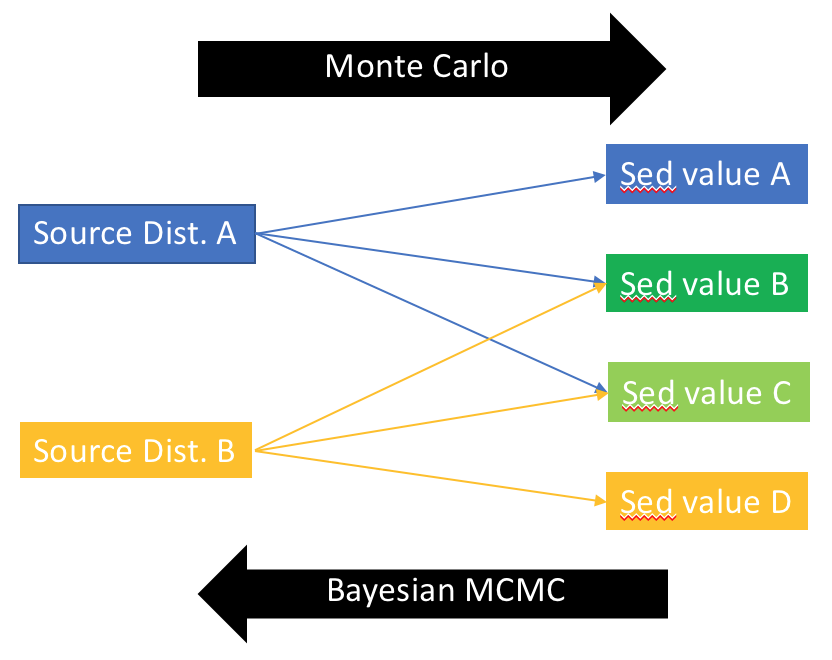

```{r "load packages", include=FALSE}
library(tidyverse)
library(plotly)
library(stats)
library(ggtern)
library(latex2exp)
library(knitr)
```

# Background/Refresher

* Here, I'm building two mixing models attempt to trace C:N, $\delta^{13}C$, and $\delta^{15}N$ values measured in Holocene lake sediments to their sources within the lake catchment.
* This .rmd file should take source data and sediment data and spit out various plots
* To work on:
  + An error analysis that uses gradients
  + How to represent the data when there are more than 3 sources --> use that filled line plot that seb whipped up.

# Monte Carlo Simulation


## Mass Balance

Define a simple mass balance equation that applies for all proxies. 

Mass balance equation:

$$
\begin{align*}
x =& \ \textrm{proxy} \ (\delta^{13}C, \ \delta^{15}N, \ or \ C\!:\!N) \\
a =& \ \textrm{amount of aquatic input} \\
t =& \ \textrm{amount of terrestrial plant input} \\
s =& \ \textrm{amount of soil input} \\
x_{total} * (a + t + s) =& (a * x_a + t * x_t + s * x_s)
\end{align*}
$$
#### Task
Expand all of this to multiple dimensions...

```{r Write equations}
#General normalization equation
normalize <- function(x, y, z) {
  x / (x + y + z)
}

#General mass balance equation
calculate_proxy <- function(a, proxy_a, t, proxy_t, s, proxy_s) {
  (a * proxy_a + t * proxy_t + s * proxy_s) / (a + t + s)
}

#Error for mass balance eqn
calculate_proxy_error <- function(a, proxy_a_error, t, proxy_t_error, s, proxy_s_error) {
  a_norm = normalize(a, t, s)
  t_norm = normalize(t, s, a)
  s_norm = normalize(s, a, t)
  sqrt((a_norm * proxy_a_error) ^ 2 + (t_norm * proxy_t_error) ^ 2 + (s_norm * proxy_s_error) ^ 2 )
}
```

## Define MC parameters

### Import source data 


```{r source data import, warning=FALSE}
source_data = read.csv("data/iceland_sources.csv")
source_data

# Just makes it easier to call later
terr <- source_data %>% 
  filter(Source == "Terrestrial")

aqua <- source_data %>% 
  filter(Source == "Aquatic")

soil <- source_data %>% 
  filter(Source == "Soil")
```

### Define parameters

```{r}
#source parameters
parameters <-
  data_frame(
    cn_a = aqua[["MeanCN"]],
    cn_t = terr[["MeanCN"]],
    cn_s = soil[["MeanCN"]],
    d13c_a = aqua[["Meand13C"]],
    d13c_t = terr[["Meand13C"]],
    d13c_s = soil[["Meand13C"]],
    d15n_a = aqua[["Meand15N"]],
    d15n_t = terr[["Meand15N"]],
    d15n_s = soil[["Meand15N"]]
  )

parameter_errors <-
  data_frame(
    cn_a = aqua[["SDCN"]],
    cn_t = terr[["SDCN"]],
    cn_s = soil[["SDCN"]],
    d13c_a = aqua[["SDd13C"]],
    d13c_t = terr[["SDd13C"]],
    d13c_s = soil[["SDd13C"]],
    d15n_a = aqua[["SDd15N"]],
    d15n_t = terr[["SDd15N"]],
    d15n_s = soil[["SDd15N"]]
  )

```

### Simulations

```{r}

#Table of input scenarios
input_scenarios <- 
  expand.grid(
    a = seq(0, 100, 10),
    t = seq(0, 100, 10),
    s = seq(0, 100, 10)
  ) %>% 
  merge(parameters) %>% 
  tbl_df()

#calculate expected proxy values given input scenarios
simulations <- 
  input_scenarios %>% 
  merge(data_frame(j = 1:5)) %>%
  mutate(
    a_norm = normalize(a, t, s),
    t_norm = normalize(t, s, a),
    s_norm = normalize(s, a, t),
    cn_a_w_error = cn_a + rnorm(length(a), sd = parameter_errors[["cn_a"]]),
    cn_t_w_error = cn_t + rnorm(length(t), sd = parameter_errors[["cn_t"]]),
    cn_s_w_error = cn_s + rnorm(length(s), sd = parameter_errors[["cn_s"]]),
    cn = calculate_proxy(a, cn_a_w_error, t, cn_t_w_error, s, cn_s_w_error),
    d13c_a_w_error = d13c_a + rnorm(length(a), sd = parameter_errors[["d13c_a"]]),
    d13c_t_w_error = d13c_t + rnorm(length(t), sd = parameter_errors[["d13c_t"]]),
    d13c_s_w_error = d13c_s + rnorm(length(s), sd = parameter_errors[["d13c_s"]]),
    d13c = calculate_proxy(a, d13c_a_w_error, t, d13c_t_w_error, s, d13c_s_w_error),
    d15n_a_w_error = d15n_a + rnorm(length(a), sd = parameter_errors[["d15n_a"]]),
    d15n_t_w_error = d15n_t + rnorm(length(t), sd = parameter_errors[["d15n_t"]]),
    d15n_s_w_error = d15n_s + rnorm(length(s), sd = parameter_errors[["d15n_s"]]),
    d15n = calculate_proxy(a, d15n_a_w_error, t, d15n_t_w_error, s, d15n_s_w_error)
  )

simulations
```


##3D plots of simulation

```{r 3D Plots, warning=FALSE}
a_sim_plot <- plot_ly(simulations, x = ~cn, y = ~d13c, z = ~d15n, color = ~a_norm) %>% 
  add_markers() %>% 
  layout(scene = list(xaxis = list(title = "C:N"),
                      yaxis = list(title = 'delta13C'),
                      zaxis = list(title = 'delta15N')),
         title = "Simulation Space") %>% 
  colorbar(title = "Aquatic input")

t_sim_plot <- plot_ly(simulations, x = ~cn, y = ~d13c, z = ~d15n, color = ~t_norm) %>% 
  add_markers() %>% 
  layout(scene = list(xaxis = list(title = "C:N"),
                      yaxis = list(title = 'delta13C'),
                      zaxis = list(title = 'delta15N')),
         title = "Simulation Space") %>% 
  colorbar(title = "Terrestrial input")

s_sim_plot <- plot_ly(simulations, x = ~cn, y = ~d13c, z = ~d15n, color = ~s_norm) %>% 
  add_markers() %>% 
  layout(scene = list(xaxis = list(title = "C:N"),
                      yaxis = list(title = 'delta13C'),
                      zaxis = list(title = 'delta15N')),
         title = "Simulation Space") %>% 
  colorbar(title = "Soil input")

a_sim_plot
t_sim_plot
s_sim_plot
```

# Data


## Import EA data

Now let's import the EA data (i.e. C:N, $\delta^{13}C$ and $\delta^{15}N$). 


```{r EA data import}
lake_name <- "VGHV"

lake_data = read.csv("data/vghv.csv")
lake_data <-
  lake_data %>%
  mutate("Age" = parse_number(Age),
         "Bsi" = parse_number(Bsi)
    )
lake_data
```


## Data plotted alone

```{r plot data alone}

lake_data_plot <- 
  lake_data %>%
  gather(var, val, c("d13C", "d15N", "C.N")) %>% 
  ggplot() +
  aes(Age, val, group = var) +
  geom_smooth(method = "loess", span = 0.2) +
  geom_point() +
  facet_grid(var~.,scales = "free_y", switch = "y") +
  scale_x_reverse(expand = c(0,500)) + 
  scale_y_continuous(name = "") +
  xlab("Age (years)") +
  labs(title = paste("Lake", lake_name))

lake_data_plot
```


## 3D plots

### Data alone

```{r 3D plot of data alone}
dataplot <- 
  plot_ly() %>% 
  add_markers(lake_data, x = lake_data$C.N, y = lake_data$d13C, z = lake_data$d15N, color = lake_data$Age) %>% 
  layout(scene = list(xaxis = list(title = "C:N"),
                      yaxis = list(title = "delta13C"),
                      zaxis = list(title = "delta15N")
                      ),
         title = paste("Lake", lake_name)) %>% 
  colorbar(title = "Age")

dataplot
```


### Data and Simulation Space Combined

```{r 3D plots of data and model, warning=FALSE}
q2 <- 
  plot_ly() %>% 
  add_markers(simulations, x = simulations$cn, y = simulations$d13c, z = simulations$d15n, color = simulations$a_norm, opacity = 0.3) %>% 
  add_markers(lake_data, x = lake_data$C.N, y = lake_data$d13C, z = lake_data$d15N, color = "red") %>% 
  layout(scene = list(xaxis = list(title = "C:N"),
                      yaxis = list(title = 'delta13C'),
                      zaxis = list(title = 'delta15N')),
         title = paste(lake_name, "Data in Simulation Space")) %>% 
  colorbar(title = "Aquatic input")

r2 <- 
  plot_ly() %>% 
  add_markers(simulations, x = simulations$cn, y = simulations$d13c, z = simulations$d15n, color = simulations$t_norm, opacity = 0.3) %>% 
  add_markers(lake_data, x = lake_data$C.N, y = lake_data$d13C, z = lake_data$d15N, color = "red") %>%
  layout(scene = list(xaxis = list(title = "C:N"),
                      yaxis = list(title = 'delta13C'),
                      zaxis = list(title = 'delta15N')),
         title = paste(lake_name, "Data in Simulation Space")) %>% 
  colorbar(title = "Terrestrial input")

s2 <- 
  plot_ly() %>% 
  add_markers(simulations, x = simulations$cn, y = simulations$d13c, z = simulations$d15n, color = simulations$s_norm, opacity = 0.3) %>% 
  add_markers(lake_data, x = lake_data$C.N, y = lake_data$d13C, z = lake_data$d15N, color = "red") %>% 
  layout(scene = list(xaxis = list(title = "C:N"),
                      yaxis = list(title = 'delta13C'),
                      zaxis = list(title = 'delta15N')),
         title = paste(lake_name, "Data in Simulation Space")) %>% 
  colorbar(title = "Soil input")

q2
r2
s2
```

## Isospace

It can be more informative to look at these plots as "isospaces", with just two of the three variables involved. This will especially help us assess whether or not our fits are going to run into trouble.

```{r, warning=FALSE}
isospace <- 
  ggplot() + 
  geom_point(data = lake_data, aes(x = d13C, y = d15N, color = Age)) + 
  #geom_path(data = lake_data, aes(x = d13C, y = d15N, color = Age), size = 0.2) +
  scale_color_gradient2(low = "dark blue", mid = "dark green", high = "gold", midpoint = 3500) +
  geom_point(data = source_data, aes(x = Meand13C, y = Meand15N), color = "black") + 
  geom_errorbar(data = source_data, aes(
    x = Meand13C, y = Meand15N, ymin = Meand15N - SDd15N, ymax = Meand15N + SDd15N)) +
  geom_errorbarh(data = source_data, aes(
    x = Meand13C, y = Meand15N, xmin = Meand13C - SDd13C, xmax = Meand13C + SDd13C)) +
  geom_text(data = source_data, aes(x = Meand13C, y = Meand15N, label = Source, hjust = -0.5, vjust = 2)) +
  labs(
    title = paste("Lake", lake_name, "Isospace"), 
    color = "Age (yrs)", 
    x = latex2exp::TeX("$\\delta^{13}C$"), 
    y = latex2exp::TeX("$\\delta^{15}N$"))
isospace
```

Previously, it looked like C:N changed more than $\delta^{15}N$. Let's see if that still looks true on an isoscape:

```{r d13C and CN isospace, warning=FALSE}
#source_data_cn <- read.csv("data/qpt_sources_cn.csv")

isospace_cn <- 
  ggplot() + 
  geom_point(data = lake_data, aes(x = d13C, y = C.N, color = Age)) + 
  #geom_path(data = lake_data, aes(x = d13C, y = d15N, color = Age), size = 0.2) +
  scale_color_gradient2(low = "dark blue", mid = "dark green", high = "gold", midpoint = 3500) +
  geom_point(data = source_data, aes(x = Meand13C, y = MeanCN), color = "black") + 
  geom_errorbar(data = source_data, aes(
    x = Meand13C, y = MeanCN, ymin = MeanCN - SDCN, ymax = MeanCN + SDCN)) +
  geom_errorbarh(data = source_data, aes(
    x = Meand13C, y = MeanCN, xmin = Meand13C - SDd13C, xmax = Meand13C + SDd13C)) +
  geom_text(data = source_data, aes(x = Meand13C, y = MeanCN, label = Source, hjust = -0.5, vjust = 2)) +
  labs(
    title = paste("Lake", lake_name, "Isospace with C:N"), 
    color = "Age (yrs)", 
    x = latex2exp::TeX("$\\delta^{13}C$"), 
    y = latex2exp::TeX("$\\C:N$"))

isospace_cn
```

# Optimization

So now we're going to try to quantify what we just observed visually. 

We're going to perform an optimization test that is going to take a real data point (C:N, d13c, d15n) and find the optimal values of a, t, s (weighted by the errors in the proxies).

How do we know how well our model is doing? We'll use the formula for distance on a Cartesian space to see how far the optimal points are from the real data. If the distance is zero, the model is right on top of our data point and we have a perfect fit!

$$
distance = \sqrt{(x_{model} - x_{real})^2 + (y_{model} - y_{real})^2 +(z_{model} - z_{real})^2}
$$

But being really far off in $\delta^{13}C$ isn't so bad because there's a lot of variation. In other words, being 2 permille off for carbon is not nearly as bad as being 2 permille off for nitrogen.

To deal with this, we'll also normalize these distances by their standard deviations. It's a little hand-wavy, but should give us a better answer than no error consideration at all.

$$
\begin{align*}
x =& \ \delta^{13}C \\
y =& \ \delta^{15}C \\
z =& \ C:N \\
distance =& \sqrt{(x_{model} - x_{real})^2 / (SD_x)^2 + (y_{model} - y_{real})^2  / (SD_y)^2 +(z_{model} - z_{real})^2  / (SD_z)^2}
\end{align*}
$$


## Optim function

#### Task
Extend to include more than three sources.

Here we'll define our optimization function. It takes a give combination of sources (c(a, t, m)) and a real piece of data (with index = i) and spits out the distance between the value predicted by the sources and the real value.

```{r Best fits}

optim_function <- function(x, i) {
  a <- x[1]
  t <- x[2]
  s <- x[3]
  
  #calculate proxies
  dcn <- calculate_proxy(a, parameters$cn_a, t, parameters$cn_t, s, parameters$cn_s)
  d13c <- calculate_proxy(a, parameters$d13c_a, t, parameters$d13c_t, s, parameters$d13c_s)
  d15n <- calculate_proxy(a, parameters$d15n_a, t, parameters$d15n_t, s, parameters$d15n_s)
  
  #calculate errors
  dcn_error <- calculate_proxy_error(a, parameter_errors$cn_a, t, parameter_errors$cn_t, s, parameter_errors$cn_s)
  d13c_error <- calculate_proxy_error(a, parameter_errors$d13c_a, t, parameter_errors$d13c_t, s, parameter_errors$d13c_s)
  d15n_error <- calculate_proxy_error(a, parameter_errors$d15n_a, t, parameter_errors$d15n_t, s, parameter_errors$d15n_s)
  
  #calculate distance btwn test point and data
  sqrt(((dcn - lake_data$C.N[i]) / dcn_error)^2 + ((d13c - lake_data$d13C[i]) / d13c_error)^2 + ((d15n - lake_data$d15N[i]) / d15n_error)^2)
}

#   sqrt((dcn - lake_data$C.N[i])^2 + (d13c - lake_data$d13C[i])^2 + (d15n - lake_data$d15N[i])^2)
# }
  
optim_function(c(1, 0, 0), 30)
```

Let's examine what this puts out:
```{r}
best_fit_i = 30
# best_fit <- optim(c(0.33, 0.33, 0.34), i = best_fit_i, optim_function, method = "L-BFGS-B", lower = 0, upper = 1)
# best_fit
```


## Fit data

#### Task
Extend to include more than three sources.

Now we're going to take our full data set and find the optimal values of a, t, and m. 

```{r}
lake_data <- lake_data %>% mutate(i = row_number())

optim_results <- 
  lake_data %>% select(i) %>% 
  group_by(i) %>%
  do({
    i <- .$i[1]
    result <- optim(c(0.33, 0.33, 0.34), i = i, optim_function, method = "L-BFGS-B", lower = 0, upper = 1)
    # normalize output
    data_frame(
      a_optim = result$par[1] / sum(result$par), 
      t_optim = result$par[2] / sum(result$par), 
      s_optim = result$par[3] / sum(result$par), 
      distance_optim = result$value,
      convergence = result$convergence # If != 0, didn't converge
    )
  })

lake_data_optim <- 
  left_join(lake_data, optim_results, by = "i") %>% 
  mutate(tot_optim = a_optim + t_optim + s_optim)
lake_data_optim
```


## Plot data (ternary)

#### Task
This could be done better with the filled lines to the bottom plot that seb whipped up.

Here, we'll create a ternary diagram with a, t, m (norm) as the axes and all our data points plotted. We'll color them by age and size them by their best fit distances.

```{r}
lake_data_optim_plot <- lake_data_optim %>% 
  #filter(Age < 1500) %>% 
  ggtern(aes(a_optim, t_optim, s_optim, color = Age, size = distance_optim)) +
  labs(x = "Aquatic", y = "Terrestrial", z = "Soil", 
       x_arrow = "Aquatic", y_arrow = "Terrestrial", z_arrow = "Soil",
       title = paste("Lake", lake_name),
       size = "Distance of fit") +
  theme_showarrows() +
  theme_nomask() + 
  geom_point() + 
  scale_color_gradient2(low = "dark blue", mid = "dark green", high = "gold", midpoint = 3600) +
  scale_size_continuous(range = c(10,1))

lake_data_optim_plot

```

## Assess fits

Now we have some results, but we already suspect that some of the fits we got from our model might not be so great. Let's analyze how good these fits are.


#### Task
Find a way to assess fits with gradients as well.

```{r}
best_fit_i = 30
best_fit <- optim(c(0.33, 0.33, 0.34), i = best_fit_i, optim_function, method = "L-BFGS-B", lower = 0, upper = 1)
#best_fit

best_fit_a = best_fit$par[1] / sum(best_fit$par)
best_fit_t = best_fit$par[2] / sum(best_fit$par)
best_fit_s = best_fit$par[3] / sum(best_fit$par)
```


This is useful, but it's still just spitting out a number. It doesn't really give us a sense of how variable the fit is. So let's do some plotting.

### Tile plot

Now let's make a ternary plot for (a, t, m), calculate how well each (a, t, m) fits sample i, and display the result as a tile weighted by the goodness of fit (0 = perfect). We'll also plot our result from "best_fit", which should show up at the optimal point.

This will allow us to see the gradient of our optim function, i.e. how much wiggle room we have with our fit. It might even allow us to see some second-best fits, i.e. local minima.


```{r, warning=FALSE}
expand.grid(
  a = seq(0,1, by=0.05),
  t = seq(0,1, by=0.05),
  s = seq(0,1, by=0.05)
) %>% 
  tbl_df() %>% 
  mutate(
    allsum = a+t+s,
    a = a/allsum,
    t = t/allsum,
    s = s/allsum,
    value = map2_dbl(a, t, ~optim_function(c(.x, .y, best_fit_s), best_fit_i))) %>% 
  filter(!is.na(value), !is.nan(value)) %>% 
  ggtern(aes(a,t,s)) +
  labs(x = "Aquatic", y = "Terrestrial", z = "Soil", 
       x_arrow = "Aquatic", y_arrow = "Terrestrial", z_arrow = "Soil",
       title = paste("Lake", lake_name),
       fill = "Distance of fit") +
  theme_showarrows() +
  theme_nomask() +
  # calculate mean estimate in each bin
  geom_tri_tern(bins = 20, mapping = aes(fill=..stat..,value=value), fun = mean) +
  # mark minimum
  geom_point(data = lake_data_optim, aes(
    x = lake_data_optim$a_optim[best_fit_i], 
    y = lake_data_optim$t_optim[best_fit_i], 
    z = lake_data_optim$s_optim[best_fit_i]), color = "red") 
  # + scale_fill_gradientn(colours = rainbow(7)) 
```


# MixSIAR

Outside of this file, I also played a lot with a mixing model called MixSIAR. 

MixSIAR is a Bayesian Markov Chain Monte Carlo stable isotope mixing model. Like the simulation we just did, it's going to take us from our data to our a, t, s space, but in a more mathematically refined way.

However, this is a more computationally expensive method, and also one that I need to dig into more to really understand what's going on and how to use it best. 

*Depending on how the Isospace plots look, we could try running this.*




# Outputs

#### Task
Make this output useful things automatically.


# Thoughts/Takeaways
* C/N might be throwing everything off. It appears to drop drastically by the time it reaches the sediment, which probably explains why most of the points fall on the edge or outside of the range.
* d13C (and d15N, probably to a lesser extent) could easily change as well, if there are isotopic differences between biomolecules.
